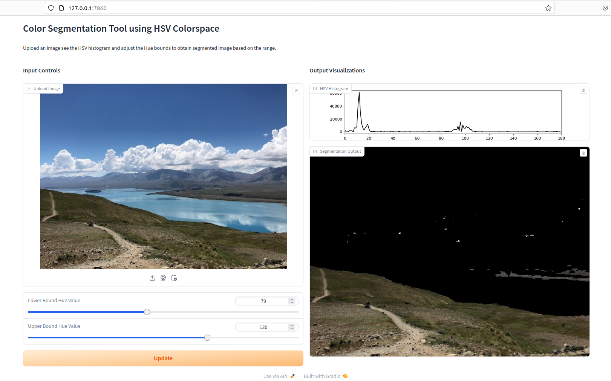

# Color Segmentation Tool 

[]([Your-Link-URL](https://huggingface.co/spaces/iamnamas/color-segmentation-bgr))

This Python application provides a user-friendly interface for segmenting images based on color spaces. The project offers two separate scripts for segmentation using BGR and HSV color spaces, respectively. This tool was developed as an engaging project during my exploration of image processing techniques in Python.

 

## Features

- Interactive web-based interface using Gradio.
- Allows users to upload images and apply color segmentation in BGR and HSV color spaces.
- Adjustable parameters for fine-tuning the segmentation.

## Installation

Before running the application, make sure you have Python installed on your system. Additional Python libraries are required, which can be installed via pip.

1. Clone the repository:

```bash
git clone https://github.com/your-username/your-repository.git
cd your-repository
```

## Installation

Install the required libraries:

```bash
pip install numpy opencv-python matplotlib gradio
```

## Usage

To use this tool, you have two options based on the color space:

- For BGR Color Space: Run the `bgr_color_segmentation.py` script.

```bash
python bgr_color_segmentation.py
```
- For HSV Color Space: Run the `hsv_color_segmentation.py` script.

```bash
python hsv_color_segmentation.py
```

After running the script, the web interface will open in your browser. Here, you can upload an image and adjust the color space parameters to view the segmented image and histograms.

## Notes

- Ensure your images are in a compatible format (e.g., JPEG, PNG).
- Experiment with different color space parameters for optimal results.

## Contributing

Contributions to enhance this tool or to extend its capabilities are most welcome. Feel free to fork this repository and submit pull requests for any improvements or bug fixes.

## License

MIT
